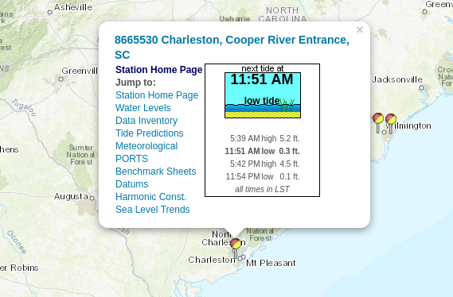

```{r setup, include=FALSE}
knitr::opts_chunk$set(echo = TRUE)
knitr::opts_chunk$set(root_dir = '../')
```

A [recent article](https://www.postandcourier.com/news/slowly-but-surely-south-carolina-s-incredibly-complex-shoreline-is/article_46e18626-cde8-11e6-be82-6393ed1dbe62.html) in the *Post and Courier* on sea level rise got my attention. 
I think it would be great exercise for my students to examine the raw data. 
Jim Morris, at USC, kindly pointed me towards the NOAA datasets that are available online. 
It is quite simple to download historic data for a single station.
Unfortunately I found that NOAA's api only allows you to automate the downloading of water level data for the past 30 days.
Although the great folks at RopenSci have created the R package [`rnoaa`](https://github.com/ropensci/rnoaa) it does not appear that this tool
will work for the historic data until NOAA provides long-term search for this
data produce on their API.

This data comes from the [NOAA Charleston, Cooper River Entrance, SC - Station ID: 8665530](https://tidesandcurrents.noaa.gov/stationhome.html?id=8665530). 



```{r read data in}
# url for data: 
# https://tidesandcurrents.noaa.gov/waterlevels.html?id=8665530&units=standard&bdate=19211001&edate=20501101&timezone=GMT&datum=MLLW&interval=m&action=data
# metadata on data fields: 
# https://tidesandcurrents.noaa.gov/datum_options.html
water_ht <- read.csv('./data/CO-OPS__8665530__ml.csv')
head(water_ht)
# make a date variable
water_ht$date <- with(water_ht, 
                      as.Date(paste(Year, Month, 01, sep = "-")))
```

Let's now examine some of the long and short term trends in the data:

```{r examine trends in mean sea level}
msl_lm = lm(MSL ~ date, data = water_ht)

plot(MSL ~ date, data = water_ht, type = 'l', col = 'grey', 
     xlab = 'Date', ylab = 'Mean sea level (m)')
lines(with(water_ht, lowess(date, MSL, f = 0.1)), col = 'red', lwd=2)
abline(msl_lm, col = 'blue', lwd = 2)
```

Clearly there is a long-term positive trend in increasing sea level rise that
appears to be accelerating in the last decade or so.
The post and courier article (URL referenced above) quoted Jim as stating that in Charleston the long term trend was 0.01 inches per year and the recent trend was 0.15 inches per year.  
Let's see if an independent analysis agrees with this estimate.
I'll look at just the last 5 years of data for the recent trend.

```{r short term trend}
# long term trend
long_rate = coef(msl_lm)[2] 
# estimate short term trend (last 5 years)
recent_rate = coef(lm(MSL ~ date, data = water_ht, subset = date > "2013-01-01"))[2]
rates = c(long_rate, recent_rate)

annual_rate_m = rates * 12
annual_rate_in = annual_rate_m * 39.3701
names(annual_rate_in) = c('long-term', 'short-term')
annual_rate_in
annual_rate_in[2] / annual_rate_in[1]
```

My estimates are not quite matching what was quoted in the article but it is clear that in the past five years the rate of sea level rise has tripled. 

```{r compute change in MSL, eval=FALSE, echo=FALSE}
## this is not working!!
water_zoo = as.zoo(water_ht)
tst = zoo::rollapply(zoo(water_ht, water_ht$date),  width=12 * 10,
          FUN = function(Z) 
          { 
             mod = lm(formula=MSL ~ date, data = as.data.frame(Z)); 
             return(mod$coef[2]) 
          },
          by.column=FALSE, align="right") 

str(tst)
plot(tst)
```